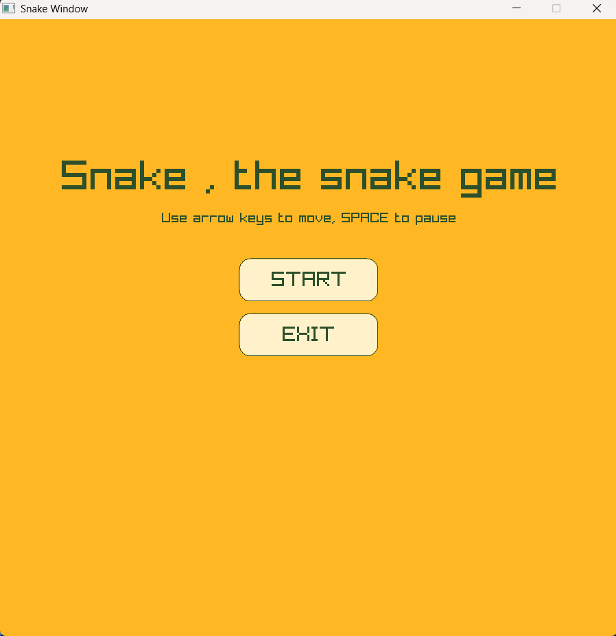
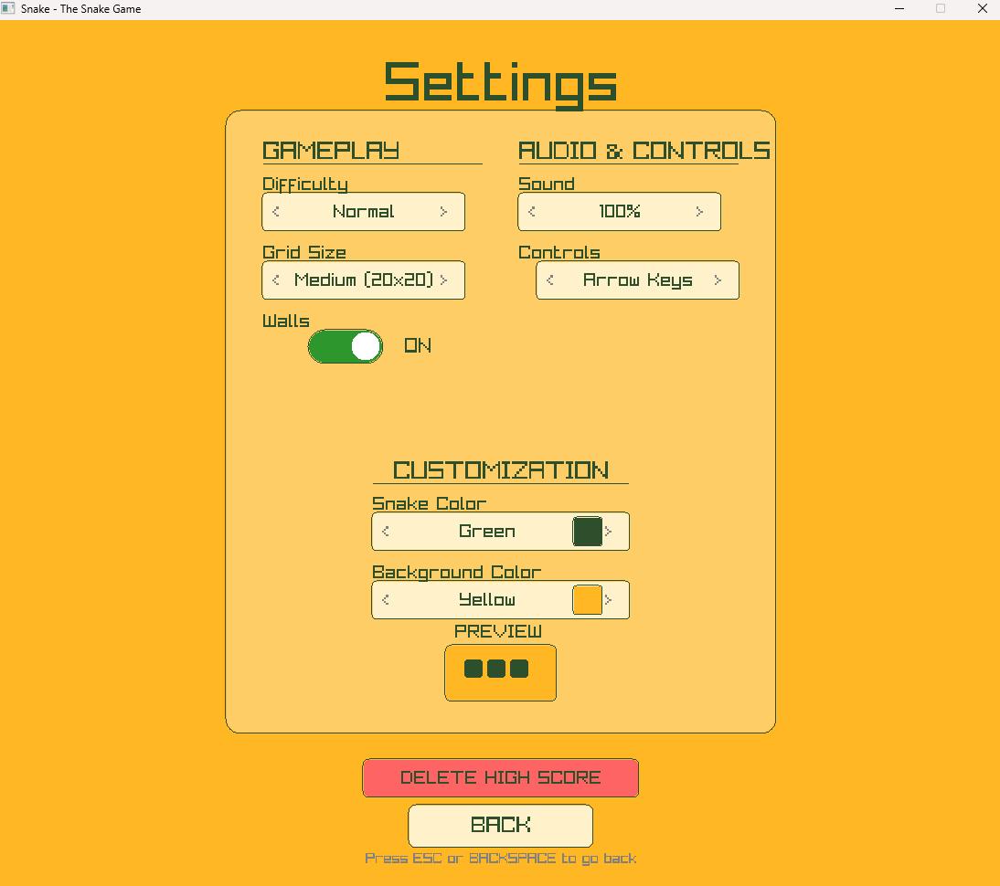
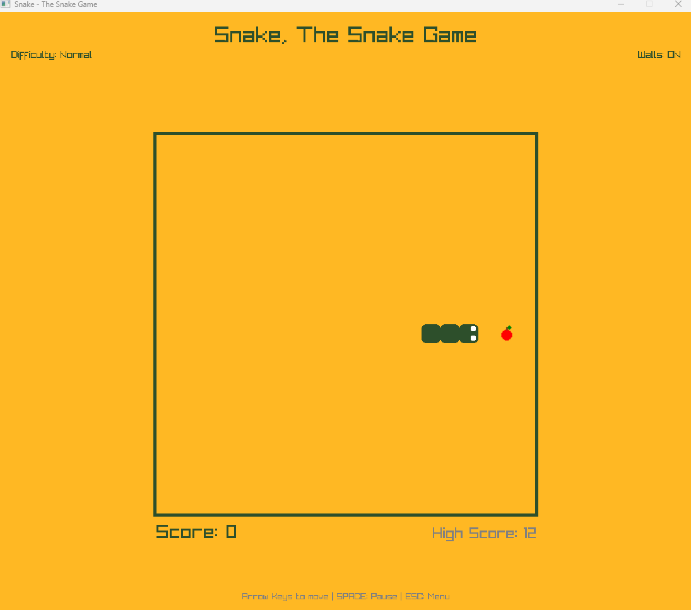
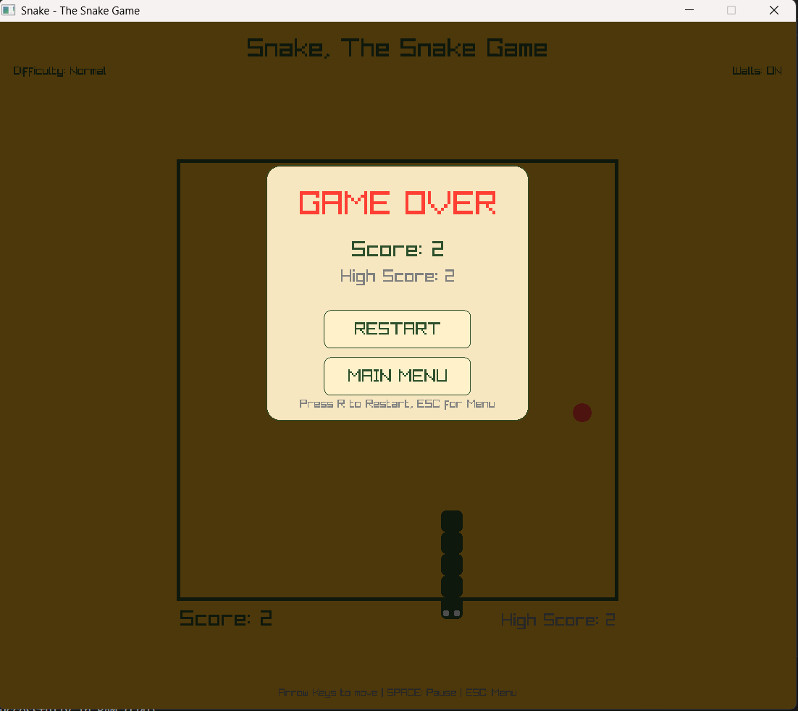

# 🐍 Snake-the-snake-game

A modern implementation of the classic Snake game built with C++ and raylib. Navigate the snake, eat apples to grow longer, and avoid collisions as you rack up your score!

<div align="center">

## 🎮 Game Screenshots

### Main Menu

*Clean and intuitive main menu with Start, Settings, and Exit options*

### Settings Menu

*Comprehensive settings with difficulty, grid size, controls, and customization options*

### Gameplay

*In-game action showing the snake with eyes, apple, score, and game info*

### Game Over

*Game over screen with score display and restart options*

</div>

## 📋 Table of Contents

- [Features](#-features)
- [Settings Menu](#-settings-menu)
- [Technologies](#-technologies)
- [Prerequisites](#-prerequisites)
- [Installation](#-installation)
- [How to Build](#-how-to-build)
- [How to Play](#-how-to-play)
- [Controls](#-controls)
- [Game Rules](#-game-rules)
- [Project Structure](#-project-structure)
- [Contributing](#-contributing)

---

## ✨ Features

- 🎮 **Smooth Gameplay** - Grid-based movement with responsive controls
- 🍎 **Apple Collection** - Eat apples to grow your snake and increase your score
- 📊 **Score & High Score Tracking** - Track your best performance during each session
- 🎨 **Full Customization** - Change snake color, background color, and more
- ⚙️ **Settings Menu** - Comprehensive settings with live preview
- ⏸️ **Pause Menu** - Full pause menu with resume, restart, settings, and menu options
- 🔄 **Quick Restart** - Instantly restart with keyboard shortcut
- 🎯 **Multiple Difficulty Levels** - Easy, Normal, and Hard modes
- 📐 **Adjustable Grid Size** - Small (15x15), Medium (20x20), or Large (25x25)
- 🧱 **Wall Mode Toggle** - Choose between wall collision or wrap-around gameplay
- 🎹 **Multiple Control Schemes** - Arrow Keys or WASD support
- 👀 **Snake Eyes** - Visual indicator showing snake's direction

## ⚙️ Settings Menu

The game includes a comprehensive settings menu accessible from the main menu or pause screen:

### Gameplay Settings
| Setting | Options | Description |
|---------|---------|-------------|
| **Difficulty** | Easy / Normal / Hard | Adjusts snake movement speed |
| **Grid Size** | Small / Medium / Large | Changes the game board dimensions |
| **Walls** | ON / OFF | ON = die on wall collision, OFF = wrap around screen |

### Audio & Controls
| Setting | Options | Description |
|---------|---------|-------------|
| **Sound** | OFF / 25% / 50% / 75% / 100% | Adjust game sound volume levels |
| **Controls** | Arrow Keys / WASD | Choose your preferred control scheme |

### Customization
| Setting | Options | Description |
|---------|---------|-------------|
| **Snake Color** | Green, Blue, Purple, Red, Orange, Cyan | Customize your snake's appearance |
| **Background Color** | Yellow, Light Blue, Pink, Light Green, White | Change the game background |

## 🛠 Technologies

This project is built using:

- **C++17** - Core game logic and programming
- **raylib** - Graphics rendering and game framework
- **MSYS2/MinGW-w64** - Build toolchain for Windows

## 📦 Prerequisites

Before you begin, ensure you have the following installed:

- **MSYS2** with MinGW-w64 toolchain
- **raylib** library (installed via MSYS2)
- **g++** compiler
- **Git** (for cloning the repository)

### Installing raylib on Windows (MSYS2)

```bash
# Open MSYS2 UCRT64 terminal
pacman -S mingw-w64-ucrt-x86_64-raylib
pacman -S mingw-w64-ucrt-x86_64-gcc
```

## 📥 Installation

1. **Clone the repository**
   ```bash
   git clone https://github.com/yourusername/Snake-the-snake-game.git
   cd Snake-the-snake-game
   ```

2. **Ensure raylib is installed** (see Prerequisites section)

3. **Build the project** (see next section)

## 🔨 How to Build

### Option 1: Using VS Code Task (Recommended)

If you're using VS Code, simply use the build task:

1. Press `Ctrl+Shift+B`
2. Select "build raylib project"

### Option 2: Manual Build

Open your terminal and run:

```bash
g++ -g -std=c++17 main.cpp globals.cpp -o main.exe -I C:/msys64/ucrt64/include -L C:/msys64/ucrt64/lib -lraylib -lwinmm -lgdi32 -lopengl32 -static-libgcc -static-libstdc++
```

**Note:** Adjust the include and library paths if your MSYS2 installation is in a different location.

## 🎯 How to Play

1. **Run the game**
   ```bash
   ./main.exe
   ```

2. **Start playing**
   - Click "START GAME" or press ENTER on the main menu
   - Use arrow keys or WASD to control your snake
   - Collect apples to grow and increase your score
   - Avoid hitting walls (if enabled) or your own body

3. **Pause the game**
   - Press SPACE or P to pause
   - Access settings, restart, or return to menu from pause screen

4. **Game Over**
   - When you collide, a game-over screen appears
   - View your score and high score
   - Press R to restart or ESC for main menu

## 🎮 Controls

### Menu Controls
| Action | Key(s) |
|--------|--------|
| Start Game | ENTER or Click |
| Exit Game | ESC |
| Navigate | Mouse |

### Gameplay Controls (Arrow Keys mode)
| Action | Key(s) |
|--------|--------|
| Move Up | ↑ |
| Move Down | ↓ |
| Move Left | ← |
| Move Right | → |
| Pause / Resume | SPACE or P |
| Quick Restart | R |
| Open Pause Menu | ESC |

### Gameplay Controls (WASD mode)
| Action | Key(s) |
|--------|--------|
| Move Up | W |
| Move Down | S |
| Move Left | A |
| Move Right | D |
| Pause / Resume | SPACE or P |
| Quick Restart | R |
| Open Pause Menu | ESC |

### Settings Menu Controls
| Action | Key(s) |
|--------|--------|
| Go Back | ESC or BACKSPACE |
| Change Options | Click < > arrows |
| Toggle Settings | Click toggle |

## 📖 Game Rules

- 🐍 The snake starts with 3 segments
- 🍎 Each apple eaten adds one segment to the snake
- 📈 Your score increases with each apple collected
- 🏆 High score is tracked during your session
- 💥 The game ends if you:
  - Hit the boundary walls (when Walls are ON)
  - Collide with your own body
- 🔄 With Walls OFF, the snake wraps around to the opposite side
- ⚡ You cannot reverse direction instantly (e.g., can't go directly from right to left)

### Difficulty Speeds
| Difficulty | Update Interval |
|------------|-----------------|
| Easy | 0.4 seconds |
| Normal | 0.25 seconds |
| Hard | 0.15 seconds |

## 📁 Project Structure

```
Snake-the-snake-game/
│
├── main.cpp           # Main game loop and entry point
├── globals.h          # Global declarations and enums
├── globals.cpp        # Global implementations
├── ui.h               # UI components (buttons, selectors)
├── game.h             # Game logic (Snake, Apple, Game classes)
├── screens.h          # Screen drawing functions
├── main.exe           # Compiled executable
├── README.md          # Project documentation
│
├── .vscode/           # VS Code configuration
│   ├── tasks.json     # Build tasks
│   └── launch.json    # Debug configuration
│
├── Graphics/          # Game assets
│   └── apple.png      # Apple sprite texture
│
└── Images/            # Documentation images
    ├── menu_screen.png       # Main menu screenshot
    ├── settings_screen.png   # Settings menu screenshot
    ├── game_demo.png         # Gameplay screenshot
    └── game_over_screen.png  # Game over screenshot
```

## 🤝 Contributing

Contributions are welcome! Here's how you can help:

1. Fork the repository
2. Create a new branch (`git checkout -b feature/AmazingFeature`)
3. Make your changes
4. Commit your changes (`git commit -m 'Add some AmazingFeature'`)
5. Push to the branch (`git push origin feature/AmazingFeature`)
6. Open a Pull Request

### Ideas for Contributions

- Implement high score persistence (save to file)
- Add sound effects and background music
- Create power-ups (speed boost, invincibility, etc.)
- Add different game modes (timed mode, obstacle mode)
- Improve graphics with animations
- Add multiplayer support

---

**Enjoy the game! 🐍🎮**

*If you found this project helpful or fun, please consider giving it a ⭐ on GitHub!*
